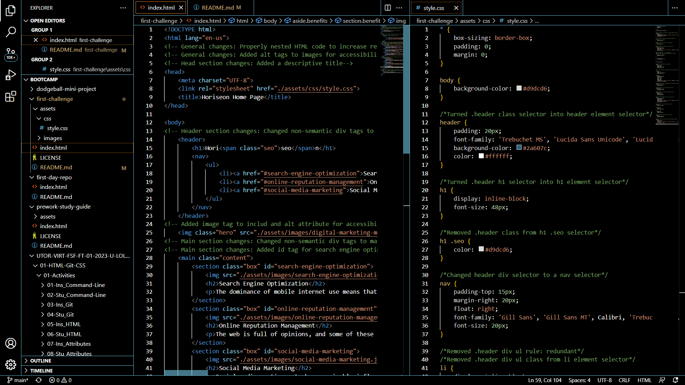

# First Challenge

## Description

This repository contains changes made to an existing website for a digital marketing firm called Horiseon. The pre-existing code, while functional, was not optimized for accessibility or readability. 

The changes made include adding semantic HTML tags in place of generic tags. The HTML code itself was not nested correctly, so that was improved for any subsequent developers who need to access the code. Partly due to the reorganizing of the HTML code, the CSS stylesheet needed major overhaul as well. In total, 21 lines of HTML code and 78 lines of CSS code were removed due to redundancy. THe result is a much cleaner, and properly accessible webpage with working links.

## Usage

Find attached below, a screenshot of the completed HTML and CSS codes side-by-side.

'''md

'''

## Credits

On this challenge, credit is due to The W3C Markup Validation Service at https://validator.w3.org/#validate_by_uri+with_options which was used to validate HTML code after changes were made. This resource was referred by fellow Bootcamp student Stefan Marinov, many thanks to him.

Lastly, I would also like to thank fellow classmates Mario Repas, Taddeo Costanzo, and John Abounassar, who collaborated during the refining of the Horiseon website.

## License

MIT License
Copyright (c) 2023 KirkHagglund
